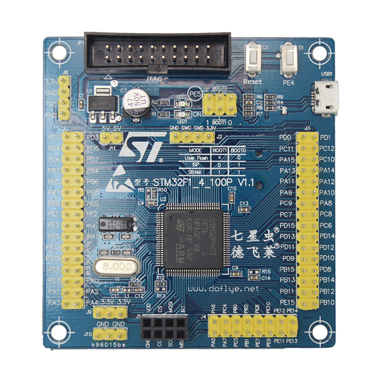

# STM32F4 dofly 开发板 BSP 说明

此仓库需要克隆在`rt-thread目录/bsp/stm32/`下使用

```sh
# 快速开始
git clone -b v5.1.x https://github.com/RT-Thread/rt-thread.git
git clone https://github.com/czstara12/rt-thread-bsp-stm32f407-doflye.git rt-thread/bsp/stm32/stm32f407-doflye
cd rt-thread/bsp/stm32/stm32f407-doflye
scons
```

不能编译请添加环境变量

```sh
export RTT_EXEC_PATH=[GCC路径]
export RTT_CC=gcc
export RTT_ROOT=[RTT仓库路径]
```

## 简介

本文档为德飞莱STM32F4VET6开发板的 BSP (板级支持包) 说明。

主要内容如下：

- 开发板资源介绍
- BSP 快速上手
- 进阶使用方法

通过阅读快速上手章节开发者可以快速地上手该 BSP，将 RT-Thread 运行在开发板上。在进阶使用指南章节，将会介绍更多高级功能，帮助开发者利用 RT-Thread 驱动更多板载资源。

## 开发板介绍

STM32F4 dofly开发板 是一块最小核心板，最高主频为 168Mhz，该开发板具有STM32F407VET6核心，可以充分发挥 STM32F407 的芯片性能。

开发板外观如下图所示：



该开发板常用 **板载资源** 如下：

- MCU：STM32F407VGT6，主频 168MHz，1024KB FLASH ，192KB RAM
- 常用外设
  - LED：1个用户 LEDs， LED2（red，PE5）
  - 按键，2个，Reset 和 User。
  - micro usb接口
  - 24l01无线通讯模块插座
- 调试接口，SWD接口,串口TTL和标准20P JTAG

## 外设支持

本 BSP 目前对外设的支持情况如下：

| **片上外设** | **支持情况** |               **备注**                |
| :------------ | :----------: | :-----------------------------------: |
| GPIO         |     支持     |  |
| UART         |     支持     |              UART1              |
| SPI          |     支持     |               SPI1               |
| I2C          |     支持     |               软件 I2C                |
| NRF24L01     |     支持     |           板载无线模块接口            |

## 使用说明

使用说明分为如下两个章节：

- 快速上手

    本章节是为刚接触 RT-Thread 的新手准备的使用说明，遵循简单的步骤即可将 RT-Thread 操作系统运行在该开发板上，看到实验效果 。

- 进阶使用

    本章节是为需要在 RT-Thread 操作系统上使用更多开发板资源的开发者准备的。通过使用 ENV 工具对 BSP 进行配置，可以开启更多板载资源，实现更多高级功能。


### 快速上手

本 BSP 为开发者提供MDK5工程，并且支持 GCC 开发环境。下面以 MDK5 开发环境为例，介绍如何将系统运行起来。

#### 硬件连接

使用数据线连接开发板到 PC，打开电源开关。

#### 编译下载

双击 project.uvprojx 文件，打开 MDK5 工程，编译并下载程序到开发板。

> 工程默认配置使用 ST-LINK 下载程序，在通过ST-LINK 连接开发板的基础上，点击下载按钮即可下载程序到开发板

#### 运行结果

下载程序成功之后，系统会自动运行，观察开发板上 LED 的运行效果，红色 LD1 和 LD2 常亮，红色 LD5 会周期性闪烁。

连接开发板对应串口到 PC , 在终端工具里打开相应的串口（115200-8-1-N），复位设备后，可以看到 RT-Thread 的输出信息:

```c
 \ | /
- RT -     Thread Operating System
 / | \     5.1.0 build Nov 19 2014
 2006 - 2024 Copyright by rt-thread team
msh >
```
### 进阶使用

此 BSP 默认只开启了 GPIO 和 串口1 的功能，更多高级功能，需要利用 ENV 工具对 BSP 进行配置，步骤如下：

1. 在 bsp 下打开 env 工具。

2. 输入`menuconfig`命令配置工程，配置好之后保存退出。

3. 输入`pkgs --update`命令更新软件包。

4. 输入`scons --target=mdk4/mdk5/iar` 命令重新生成工程。

本章节更多详细的介绍请参考 [STM32 系列 BSP 外设驱动使用教程](../docs/STM32系列BSP外设驱动使用教程.md)。

#### NRF24L01 使用说明

本 BSP 支持板载 NRF24L01 无线模块接口，驱动基于 RT-Thread SPI 设备框架实现。

**配置步骤**：

1. 在 ENV 工具中输入 `menuconfig`
2. 进入 `Hardware Drivers Config` -> `Board extended module Drivers`
3. 勾选 `Enable NRF24L01`

**引脚连接**：

| 信号 | 引脚 | 备注 |
| :--- | :--- | :--- |
| CE   | PA4  | 控制引脚 |
| CSN  | PC4  | 片选引脚 |
| IRQ  | PC5  | 中断引脚 |
| SCK  | PA5  | SPI1 CLK |
| MISO | PA6  | SPI1 MISO |
| MOSI | PA7  | SPI1 MOSI |

**测试命令**：

系统启动后会自动初始化 NRF24L01。可以使用 `nrf24` 命令进行测试：

- 检测模块：`nrf24 check`
- 读取寄存器：`nrf24 reg`
- 发送测试包：`nrf24 send <data>`

## 注意事项

暂无

## 联系人信息

维护人:

- [czstara12](https://github.com/czstara12) 

## TODO

1. 暂无
